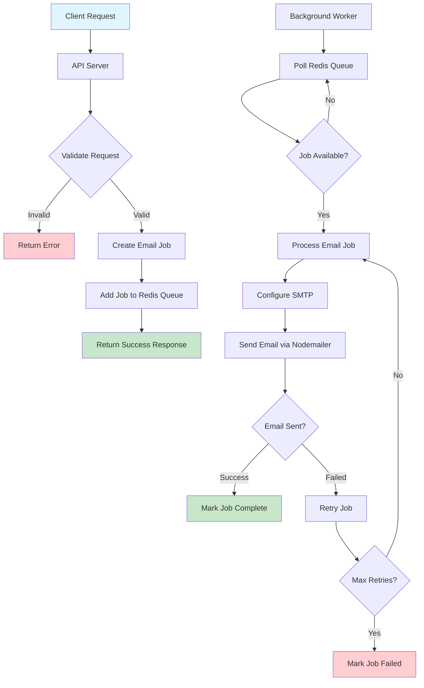

# Email Service

A robust email service API built with Node.js, TypeScript, and Redis for handling email sending operations via webhook with queue management using BullJS and Redis for efficient background processing.

- You need to have a SMTP provider. Like hostinger, gmail, outlook etc...

## Features

- **RESTful API** for sending emails
- **Queue Management** using BullMQ and Redis
- **Background Processing** with dedicated worker processes
- **Email Templates** support
- **Queue Monitoring** with Bull Board dashboard
- **Docker Support** for easy deployment
- **TypeScript** for type safety

## Tech Stack

- **Node.js** with TypeScript
- **Express.js** for API server
- **BullMQ** for job queue management
- **Redis** for queue storage
- **Nodemailer** for email sending
- **Bull Board** for queue monitoring
- **Docker** for containerization

## Email Sending Flow



### Flow Description

1. **API Request**: Client sends email request to the API server
2. **Validation**: Server validates the request data (recipient, subject, body, etc.)
3. **Job Creation**: If valid, creates an email job with the request data
4. **Queue Storage**: Job is added to Redis queue for background processing
5. **Immediate Response**: API returns success response to client (non-blocking)
6. **Background Processing**: Worker continuously polls the Redis queue
7. **Email Sending**: Worker processes jobs by sending emails via SMTP
8. **Error Handling**: Failed jobs are retried with exponential backoff
9. **Monitoring**: Bull Board provides real-time queue monitoring

## Project Structure

```
src/
├── adapters/          # External service adapters
├── application/       # Application services and use cases
├── core/             # Domain entities and business logic
├── presentation/     # API controllers and routes
├── shared/           # Shared utilities and configurations
├── server.ts         # Main API server
└── worker.ts         # Background job processor
```

## Getting Started

### Prerequisites

- Docker
- Docker Compose

### Installation

1. Clone the repository:

```bash
git clone https://github.com/guicoelhodev/email-service.git email-service
cd email-service
```

2. Set up environment variables:

## Environment Variables

Create a `.env` file with the following variables:

```env
# Server Configuration
PORT=3000
NODE_ENV=development

# Redis Configuration
REDIS_HOST=localhost
REDIS_PORT=6379

# Email Configuration
SMTP_HOST=smtp.gmail.com
SMTP_PORT=587
SMTP_USER=your-email@gmail.com
SMTP_PASS=your-app-password
```

### Development

Start all services with Docker Compose:

```bash
docker-compose up -d
```

This will start:

- Redis server
- API server
- Background worker
- Bull Board dashboard

### Production

For production deployment:

```bash
docker-compose -f docker-compose.prod.yml up -d
```

## Scripts

- `npm run dev` - Start API server in development mode
- `npm run worker` - Start background worker in development mode
- `npm run build` - Build TypeScript to JavaScript
- `npm start` - Start production API server
- `npm run start:worker` - Start production worker

## API Endpoints

### Send Email

```http
POST /send-email
Content-Type: application/json

{
  "to": "recipient@example.com",
  "subject": "Email Subject",
  "body": "Email content",
  "from": "sender@example.com"
}
```

### Queue Dashboard

Access the Bull Board dashboard at `http://localhost:3000/admin/queues` to monitor email jobs.
